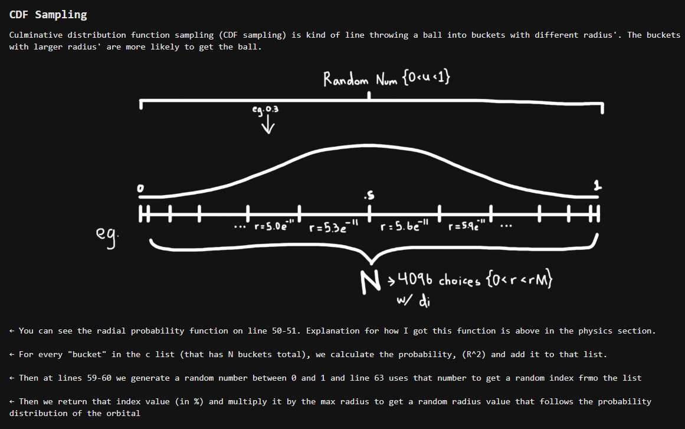

# **Hydrogen Quantum Orbital Visualizer**

Here is the raw code for the atom simulation, includes raytracer version, realtime runner, and 2D version

What the model does:
1. Takes the quantum numbers (n, l, m) that describe an orbital's shape
2. Using the schrodinger equation, sample r, theta, and phi coordinates from those quantum numbers
3. Render those possible positions and color code them relative to their probabilities (brighter areas have higher probability)

## **Visualization**

### Schrödinger Equation



### Demo Video

https://github.com/shanmuckh/Atom_Simulation/blob/main/atoms-simulation.mp4


## **Building Requirements:**

1. C++ Compiler supporting C++ 17 or newer

2. [Cmake](https://cmake.org/)

3. [Vcpkg](https://vcpkg.io/en/)

4. [Git](https://git-scm.com/)

## **Build Instructions:**

1. Clone the repository:
	-  `git clone https://github.com/shanmuckh/Atom_Simulation.git`
2. CD into the newly cloned directory
	- `cd ./Atom_simulation` 
3. Install dependencies with Vcpkg
	- `vcpkg install`
4. Get the vcpkg cmake toolchain file path
	- `vcpkg integrate install`
	- This will output something like : `CMake projects should use: "-DCMAKE_TOOLCHAIN_FILE=/path/to/vcpkg/scripts/buildsystems/vcpkg.cmake"`
5. Create a build directory
	- `mkdir build`
6. Configure project with CMake
	-  `cmake -B build -S . -DCMAKE_TOOLCHAIN_FILE=/path/to/vcpkg/scripts/buildsystems/vcpkg.cmake`
	- Use the vcpkg cmake toolchain path from above
7. Build the project
	- `cmake --build build`
8. Run the program
	- The executables will be located in the build folder

### Alternative: Debian/Ubuntu apt workaround

If you don't want to use vcpkg, or you just need a quick way to install the native development packages on Debian/Ubuntu, install these packages and then run the normal CMake steps above:

```bash
sudo apt update
sudo apt install build-essential cmake \
	libglew-dev libglfw3-dev libglm-dev libgl1-mesa-dev
```

This provides the GLEW, GLFW, GLM and OpenGL development files so `find_package(...)` calls in `CMakeLists.txt` can locate the libraries. After installing, run the `cmake -B build -S .` and `cmake --build build` commands as shown in the Build Instructions.

## **How the code works:**
the 2D bohr model works is in atom.cpp, the raytracer and realtime models are right beside
* warning, I would recommend running the realtime model with <100k particles first to be sure, raytracer is super compu-intensive so make sure your system can handle it!
